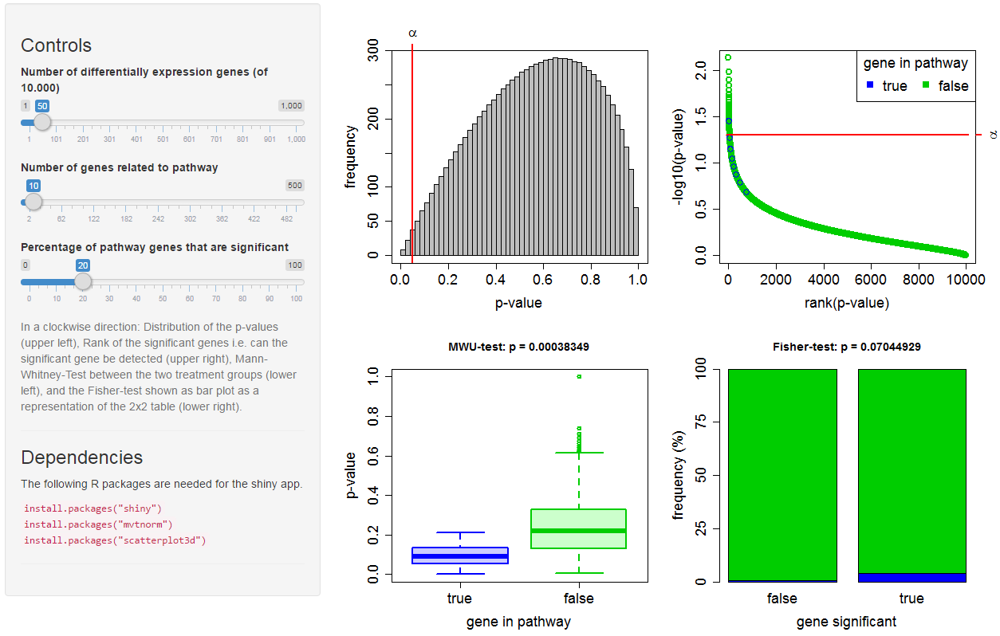

# Visualisation of gene set enrichment



## Dependencies
The following R packages are needed for the Shiny app:

```R
install.packages("shiny")
install.packages("mvtnorm")
install.packages("scatterplot3d") 
```

## Installation

```R
library(shiny)

runGitHub("geneset_enrichment", "jkruppa")
```
